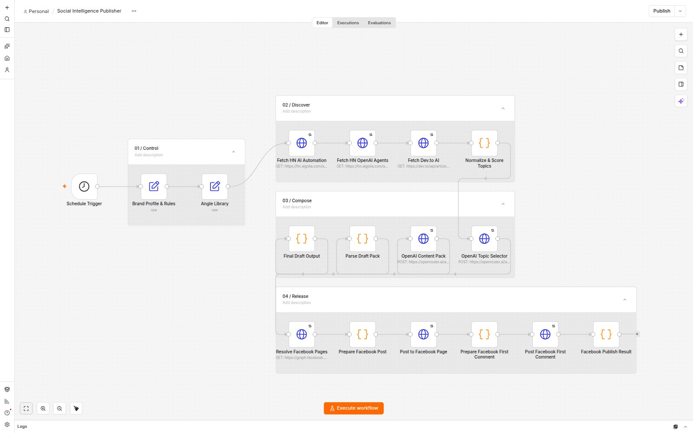

# Social Intelligence Publisher

An n8n workflow that turns live technology signals into a ranked, source-linked Arabic content draft and can publish it to a Facebook Page with the source URL in the first comment.



> This path is reserved for the real authenticated n8n canvas capture. No generated diagram or substitute banner is used.

## What it does

1. Loads the AZAR brand rules and editorial angles.
2. Collects live results from two Hacker News searches and the Dev.to API.
3. Normalizes, deduplicates, and ranks candidates with deterministic scoring.
4. Uses OpenRouter with `openai/gpt-4.1-mini` to select a topic and produce a structured Arabic content pack.
5. Validates the output and prepares a Facebook Page post plus first comment.
6. Publishes through Meta Graph API after a Page credential is configured.

## Verification

The repository contains evidence from a real local n8n execution on 23 September 2026:

| Check | Result |
| --- | --- |
| Execution ID | `8` |
| Status | `success` |
| Duration | 22.790 seconds |
| Live inputs | 8 HN automation + 8 HN agents + 8 Dev.to articles |
| Ranked candidates | 10 |
| AI model | `openai/gpt-4.1-mini` through OpenRouter |
| Measured AI cost | `$0.0018920` |
| Final draft | `draft_ready` |
| Meta publication | Verified: AZAR Page post and first source comment published |

- [Execution evidence](docs/execution-evidence.json)
- [Verification report](docs/social-intelligence-publisher-report.pdf)
- [Live verified Facebook post](https://www.facebook.com/1412927604299445/posts/1412926720966200)

The evidence covers the complete path: ingestion, scoring, AI generation, parsing, Meta Page publication, and the source-linked first comment.

## Architecture

| Stage | Nodes | Responsibility |
| --- | ---: | --- |
| `01 / Control` | 2 | Brand rules and editorial angles |
| `02 / Discover` | 4 | Live source ingestion and ranking |
| `03 / Compose` | 4 | Topic selection, content generation, validation |
| `04 / Release` | 6 | Page resolution, post, first comment, result |

The schedule trigger sits before four compact stages arranged as a readable serpentine path. The canvas uses native n8n grouping, short labels, restrained color, and no decorative sticky-note artwork.

## Real generated output

Execution `8` selected the ranked n8n candidate from Hacker News, published it to the AZAR Page, and added the source as the first comment:

> وفر وقتك مع n8n: أتمتة ووركفلو مرنة ومفتوحة المصدر بدون تعقيد برمجي. n8n تتيح لك بناء ووركفلو متكامل يدعم دمج AI بسهولة، مما يقلل الوقت المهدر في المهام اليدوية ويزيد إنتاجيتك.
>
> - أداة مفتوحة المصدر وقابلة للتخصيص بالكامل
> - تدعم دمج الذكاء الاصطناعي في الأتمتة بسلاسة
> - واجهة سهلة الاستخدام للمستخدمين التقنيين وغير التقنيين
> - تساعد على تقليل الوقت المهدر في المهام الروتينية
> - تمكنك من بناء ووركفلو بدون الحاجة لكود معقد
>
> جرب n8n الآن وابدأ أتمتة مهامك اليومية بسرعة وسهولة. الرابط في أول تعليق 👇

The generated first comment points to the selected source: `https://n8n.io/`.

## Import and configure

1. Import [`workflow/social-intelligence-publisher.json`](workflow/social-intelligence-publisher.json) into n8n.
2. Create a **Header Auth** credential for OpenRouter:
   - Name: `Authorization`
   - Value: `Bearer <OPENROUTER_API_KEY>`
3. Assign it to both AI HTTP Request nodes.
4. Create a **Query Auth** credential for Meta:
   - Name: `access_token`
   - Value: a long-lived Page access token for the target Facebook Page
5. Assign it to the three Meta HTTP nodes and confirm the Page ID in `Prepare Facebook Post`.
6. Confirm the six Release nodes are enabled, run a manual validation, and only then publish the schedule.

Never place API keys or Meta tokens directly in node URLs, code, exported JSON, screenshots, or Git history.

## Production safeguards

- Encrypted n8n credentials for OpenRouter; no key in the exported workflow.
- No embedded Meta fallback token.
- Three attempts with delay on external HTTP calls.
- Structured JSON schemas for both AI responses.
- Deterministic candidate ranking before model use.
- Execution timeout and success/error retention enabled.
- Release stage uses an encrypted, non-expiring Meta Page token (`expires_at: 0`); the credential itself is never exported.

## Repository map

```text
assets/
  n8n-workflow-canvas.png
docs/
  execution-evidence.json
  social-intelligence-publisher-report.pdf
scripts/
  build_report.py
workflow/
  Brand_Profile_Template.json
  social-intelligence-publisher.json
requirements.txt
```

## Security

See [SECURITY.md](SECURITY.md). Credentials are deliberately excluded from the portable workflow and evidence artifacts.

## License

[MIT](LICENSE)
